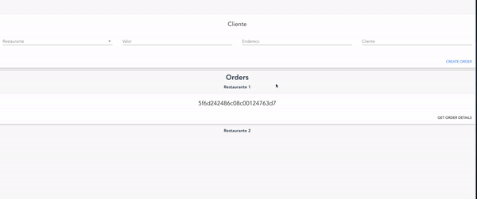

# Fiap Container Atividade

[](https://travis-ci.org/joemccann/dillinger)

> Simulação de um serviço de pedidos que atualiza em realtime as ordens para os restaurantes.

### Demonstração



### Setup

Altere env.example com suas credenciais do firebase.

```sh
$ docker-compose up
```

A stack a seguir sera gerada:

- API nodejs
- Webapp Vuejs
- Redis
- Mongo
- Nginx

### Endpoints

| METHOD | ENDPOINT |
| ------ | -------- |
| GET    | /order   |
| POST   | /order   |
